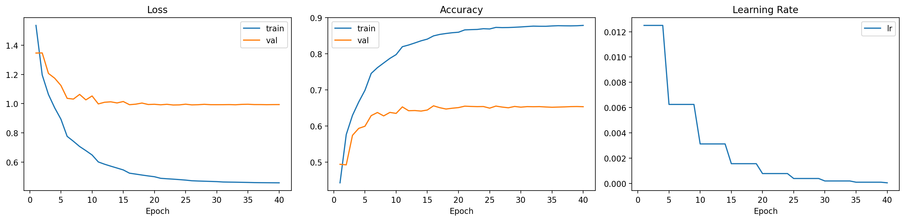
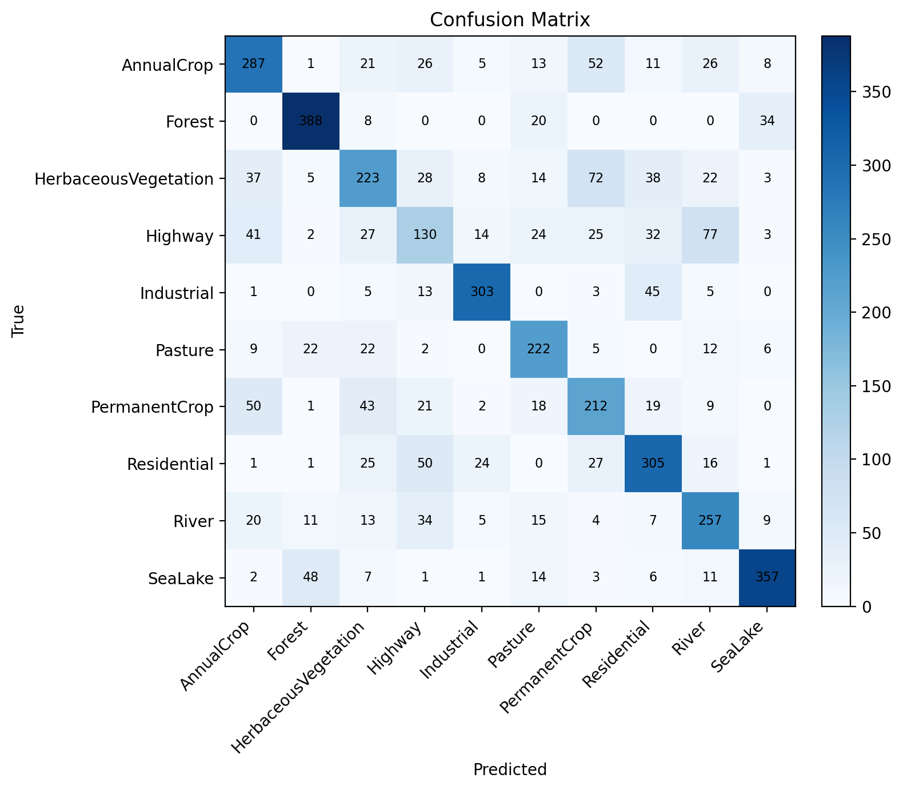
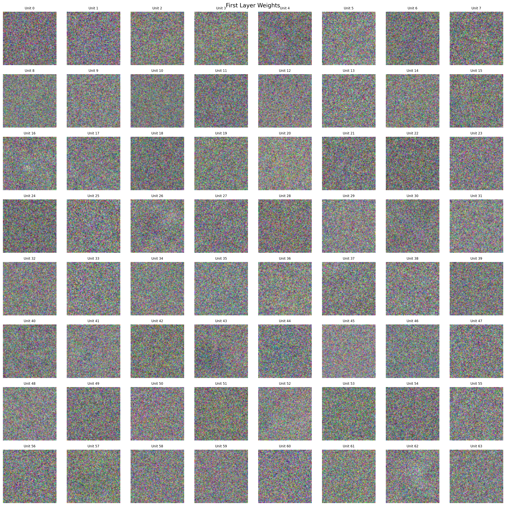
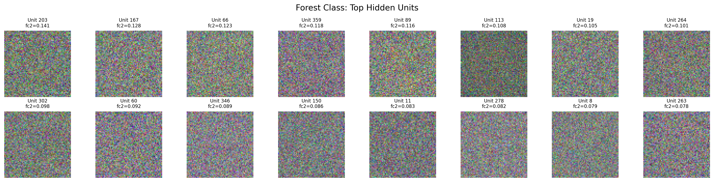
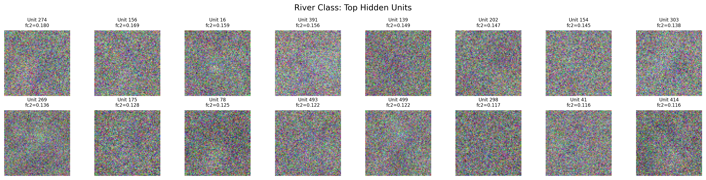
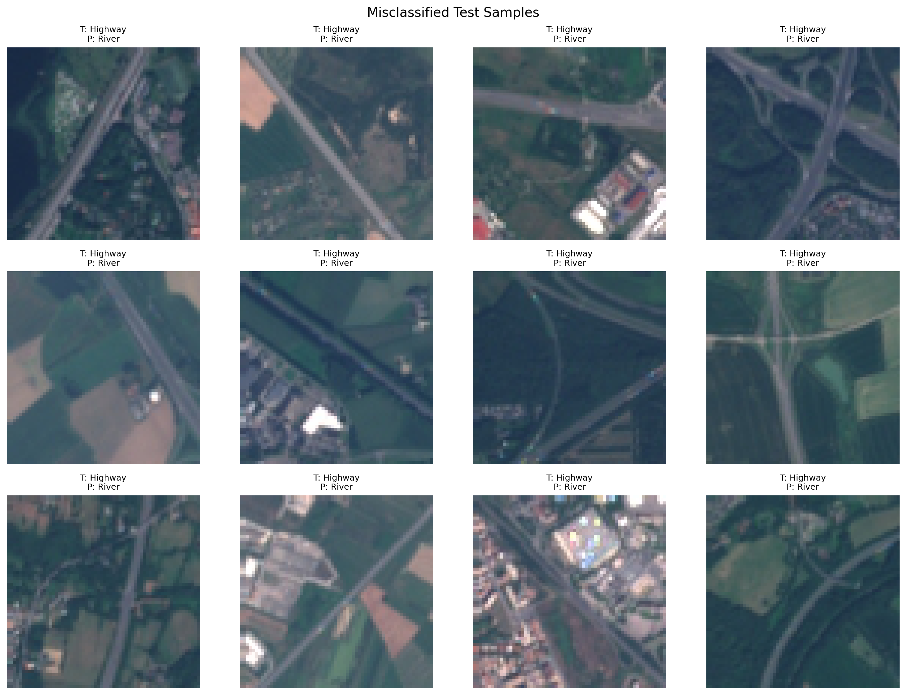
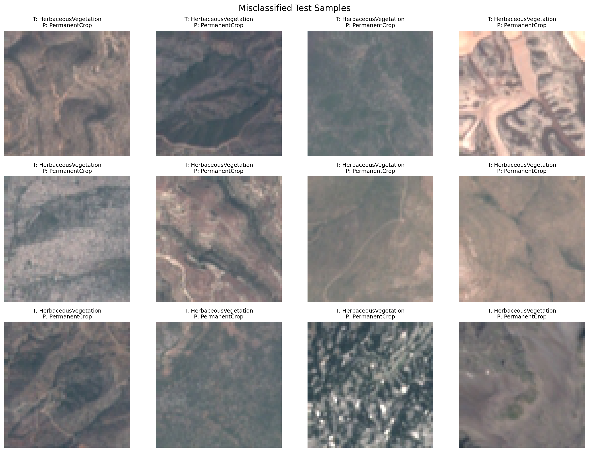
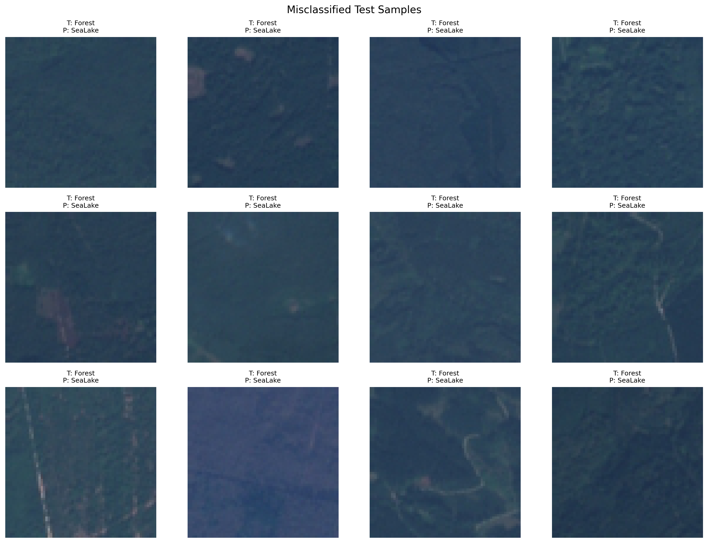

# 深度学习与空间智能课程HW1报告

## 1. 数据集与预处理

### 1.1 数据集

实验采用 `EuroSAT_RGB` 数据集，包含以下 10 个类别：

- AnnualCrop
- Forest
- HerbaceousVegetation
- Highway
- Industrial
- Pasture
- PermanentCrop
- Residential
- River
- SeaLake

所有图像大小均为 `64 × 64 × 3`。

### 1.2 数据划分

实验采用分层划分（stratified split），以保证各类别在训练集、验证集和测试集中的比例基本一致。划分比例为：

- 训练集：70%
- 验证集：15%
- 测试集：15%

本次实验的实际划分规模为：

- 训练集：18,900
- 验证集：4,050
- 测试集：4,050

### 1.3 数据预处理

预处理流程如下：

1. 读取 RGB 图像并转换为 `float32`
2. 将像素值缩放到 `[0, 1]`
3. 仅使用训练集计算通道均值和标准差
4. 使用训练集统计量对训练、验证和测试集统一标准化
5. 将图像展平为一维向量输入 MLP

输入维度为：

$$
64 \times 64 \times 3 = 12288
$$

---

## 2. 模型与训练实现

### 2.1 模型结构

模型采用单隐藏层 MLP，结构为：

$$
\text{Input}(12288) \rightarrow \text{Hidden}(H) \rightarrow \text{Output}(10)
$$

其中：

- 输入维度：12288
- 隐藏层维度：可调超参数 `hidden_dim`
- 输出维度：10

### 2.2 激活函数与梯度计算

模型支持以下激活函数：

- ReLU
- Tanh
- Sigmoid

训练过程中通过自定义自动微分机制计算损失对各参数的梯度，并利用反向传播完成更新。

### 2.3 训练策略

训练部分包含以下关键机制：

- SGD 优化器
- 学习率衰减（Step Decay）
- 交叉熵损失
- L2 正则化（Weight Decay）
- Gradient Clipping
- 根据验证集准确率自动保存最优模型权重

其中，加入 gradient clipping 的原因是早期实验中较大学习率会引起数值不稳定，甚至出现 `NaN`；加入裁剪后，训练过程明显更稳定。

---

## 3. 超参数搜索

为确定较优参数组合，实验采用两阶段搜索策略。

### 3.1 第一阶段：随机搜索

随机搜索共运行 12 组实验，用于在较大参数空间内快速定位有效区域。最佳结果为：

| 参数 | 最优值 |
|---|---|
| learning rate | 0.01 |
| hidden dim | 512 |
| weight decay | 1e-4 |
| activation | ReLU |
| best validation accuracy | 0.6486 |

随机搜索结果表明：

- `ReLU` 明显优于 `Tanh`
- 学习率 `0.01` 明显优于更小学习率
- 较大的隐藏层（512）优于 128 和 256
- 正则化强度的有效区间主要集中在 `0 ~ 1e-4`

### 3.2 第二阶段：网格搜索

在随机搜索确定的有效区域内，进一步执行 27 组网格搜索。最优组合为：

| 参数 | 最优值 |
|---|---|
| learning rate | 0.0125 |
| hidden dim | 512 |
| weight decay | 5e-4 |
| activation | ReLU |
| best validation accuracy | 0.6560 |

阶段二将验证集准确率从 `0.6486` 提升到 `0.6560`，说明在有效区域内继续做细粒度搜索能够带来稳定增益。

---

## 4. 最终训练与测试结果

使用第二阶段搜索得到的最佳参数进行正式训练，配置如下：

- `learning rate = 0.0125`
- `hidden dim = 512`
- `weight decay = 5e-4`
- `activation = relu`
- `epochs = 40`
- `batch size = 64`

正式训练结果如下：

| 指标 | 数值 |
|---|---:|
| best validation accuracy | 0.6560 |
| final test accuracy | 0.6627 |

测试集总样本数为 `4050`，正确分类 `2684` 张，整体测试准确率为：

$$
\frac{2684}{4050} = 0.6627
$$

*图 4-1 训练过程曲线。左图为训练集与验证集的 Loss 曲线，中图为训练集与验证集的 Accuracy 曲线，右图为学习率随 epoch 的变化情况。可以看出模型在前期收敛较快，后期验证集上准确率趋于稳定。*

从类别级准确率看，不同类别的识别难度差异较为明显：

| 类别 | 正确数 / 总数 | 准确率 |
|---|---:|---:|
| Forest | 388 / 450 | 0.8622 |
| Industrial | 303 / 375 | 0.8080 |
| SeaLake | 357 / 450 | 0.7933 |
| Pasture | 222 / 300 | 0.7400 |
| River | 257 / 375 | 0.6853 |
| Residential | 305 / 450 | 0.6778 |
| AnnualCrop | 287 / 450 | 0.6378 |
| PermanentCrop | 212 / 375 | 0.5653 |
| HerbaceousVegetation | 223 / 450 | 0.4956 |
| Highway | 130 / 375 | 0.3467 |

可以看出，`Forest`、`Industrial`、`SeaLake` 的识别效果相对较好，而 `Highway`、`HerbaceousVegetation`、`PermanentCrop` 的识别效果较弱。这说明当前 MLP 已能利用颜色与全局分布信息完成部分区分，但对于空间结构相近的类别仍缺乏足够判别能力。

*图 4-2 测试集混淆矩阵。对角线表示正确分类数量，非对角线表示错分数量。*

---

## 5. 第一层权重可视化分析

### 5.1 分析定义

为分析模型针对不同类别学习到的输入模式，实验对每个类别分别生成类特定的第一层权重可视化图。具体方法如下：

1. 对于某个类别 \(c\)，取第二层权重 `fc2.weight[:, c]` 中值最大的若干隐藏单元
2. 取这些隐藏单元在第一层对应的权重向量 `fc1.weight[:, u]`
3. 将每个长度为 `12288` 的向量 reshape 为 `64 × 64 × 3`
4. 将其作为图像进行可视化

本次实验已对全部 10 个类别分别生成对应的权重图。

### 5.2 结果讨论

从结果上看，这些第一层权重更接近“类别相关的全局输入模板”，而不是卷积神经网络中常见的局部卷积核，这与 MLP 缺少局部归纳偏置的特点是一致的。

*图 5-1 第一层隐藏层权重总览。图中展示了部分隐藏单元的第一层权重恢复到图像尺寸后的结果。*

为避免仅凭视觉观察得出结论，进一步对每个类别选取其最相关的 16 个隐藏单元，并统计对应第一层权重在 RGB 三个通道上的平均绝对值占比。结果显示，大部分类别的 RGB 占比均接近 `1/3`，未出现明显的单通道主导现象。例如：

- `Forest`: `R=0.3319, G=0.3338, B=0.3343`
- `River`: `R=0.3329, G=0.3344, B=0.3327`
- `SeaLake`: `R=0.3330, G=0.3363, B=0.3307`

整体来看，这说明当前模型学习到的模式并不主要依赖某一个颜色通道，而更多体现为跨通道的整体输入模板。不过，在具体类别的权重图中仍可以观察到一定的局部倾向。例如，在 `Forest` 类的类特定权重可视化中，部分隐藏单元如 `unit 203`、`66`、`302` 的绿色通道响应相对更强，这说明模型可能利用了森林场景中较常见的绿色分布特征作为判别依据之一。

| Forest 类权重图 | River 类权重图 |
|---|---|
|  |  |

*图 5-2 类特定第一层权重可视化示例。左图为 `Forest` 类最相关隐藏单元对应的第一层权重图，右图为 `River` 类对应结果。*

---

## 6. 错例分析

### 6.1 分析定义

采用“类别对双向错分率”作为错例分析指标，而非单独某一类的错分比例。对于两个类别 \(A\) 与 \(B\)，定义：

$$
\text{pairwise confusion rate} = \frac{A \rightarrow B + B \rightarrow A}{\text{samples of } A + \text{samples of } B}
$$

该指标能够更直接衡量两种类别之间的相互混淆程度。

### 6.2 错分率最高的类别对

测试集上双向错分率最高的前 5 个类别对如下：

| 排名 | 类别对 | 双向错分数 | 样本总数 | 双向错分率 |
|---|---|---:|---:|---:|
| 1 | Highway ↔ River | 111 | 750 | 0.1480 |
| 2 | HerbaceousVegetation ↔ PermanentCrop | 115 | 825 | 0.1394 |
| 3 | AnnualCrop ↔ PermanentCrop | 102 | 825 | 0.1236 |
| 4 | Highway ↔ Residential | 82 | 825 | 0.0994 |
| 5 | Forest ↔ SeaLake | 82 | 900 | 0.0911 |

| Highway 与 River 的错例 | HerbaceousVegetation 与 PermanentCrop 的错例 |
|---|---|
|  |  |

*图 6-1 高混淆类别对的错例可视化。左图展示 `Highway` 与 `River` 的双向错例，右图展示 `HerbaceousVegetation` 与 `PermanentCrop` 的双向错例。*

### 6.3 结果讨论

`Highway` 与 `River` 是当前模型最容易互相混淆的一对类别：

- `Highway -> River = 77`
- `River -> Highway = 34`
- 双向错分率为 `111 / 750 = 0.1480`

这说明模型对这两类的全局特征区分仍不充分。可能原因包括：

- 两者都可能表现出长条带状结构
- MLP 仅基于展平后的全局输入建模，难以稳定利用道路与河流在局部形状上的差异

此外，`HerbaceousVegetation` 与 `PermanentCrop`、`AnnualCrop` 与 `PermanentCrop` 也具有较高双向错分率。这些类别都与植被或耕地场景相关，在颜色和纹理分布上更接近，因此在不引入卷积结构的前提下更容易混淆。相对地，`Forest` 与 `SeaLake` 虽然整体准确率较高，但两者之间仍存在一定双向混淆，说明仅依赖全局颜色与强度分布时，模型仍会误判部分大面积自然场景。

*图 6-2 `Forest` 与 `SeaLake` 的双向错例。*

---

## 8. 结论

Github repo：https://github.com/JasonHuangFDU/-HW1
Model weights: https://github.com/JasonHuangFDU/-HW1/blob/main/experiments/final_best_model/best_model.npz

本项目完成了以下内容：

1. 使用纯 `NumPy` 实现了带自动微分的 MLP 分类器
2. 完成了数据加载与预处理、模型定义、训练循环、测试评估和超参数搜索五个核心模块
3. 实现了 SGD、学习率衰减、交叉熵损失和 L2 正则化
4. 根据验证集准确率自动保存最佳模型权重
5. 使用随机搜索和网格搜索完成超参数调优
6. 支持在独立测试集上输出准确率和混淆矩阵
 
最终实验结果表明：

- 最优验证集准确率为 `0.6560`
- 最终测试集准确率为 `0.6627`

说明纯 MLP 已具备一定的地表覆盖判别能力，但与卷积网络相比，其对局部空间结构的建模能力仍然有限。权重可视化和错例分析也说明了这一点：模型更擅长利用全局输入模式，而在若干结构相近类别之间仍存在较明显混淆。
